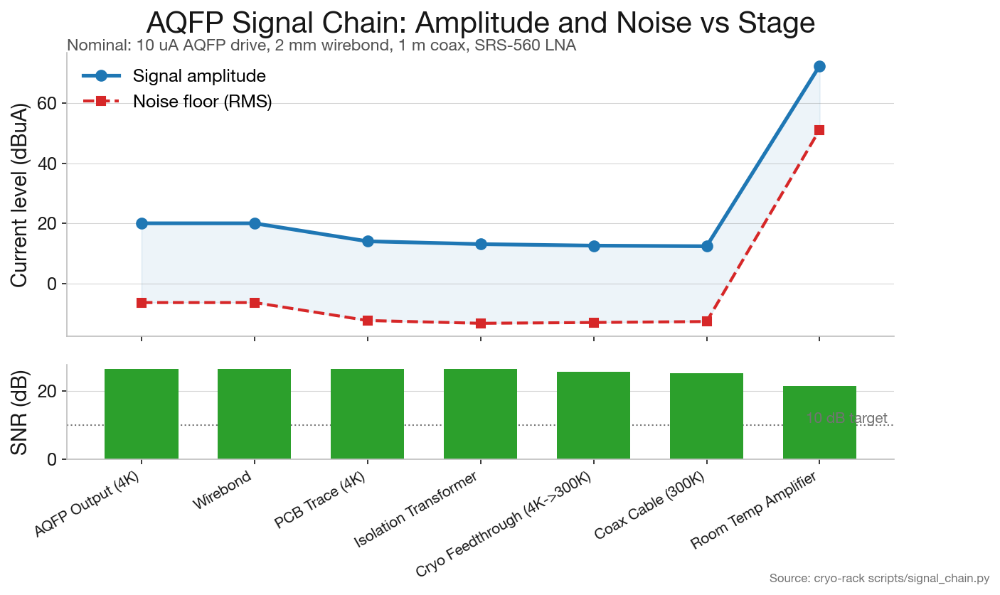

# Cryo Rack System

Cryogenic rack system design and BOM for the CBA-Vertiv collaboration, with applicability to future Adiabatic Machines deployments.

**[Design Package (PDF)](cryo-rack-design-package.pdf)** — Full system design documentation

## Project Goal

Design and procure a cryogenic demonstration rack using off-the-shelf components, targeting a one-month build timeline. The system provides a 4K environment suitable for AQFP processor testing and demonstration.

## Deployments

| Site              | Status  | Notes                          |
|-------------------|---------|--------------------------------|
| Vertiv            | Planned | Demo system, primary target    |
| CBA               | Planned | Independent test infrastructure|
| Adiabatic Machines| Planned | Integration system for Adiabatic Computing|

## Repository Structure

- `bom/` -- Bill of materials in machine-readable YAML, with site-specific overrides
- `decisions/` -- Architecture Decision Records (ADRs) capturing design choices and rationale
- `docs/` -- System architecture, integration notes, and project timeline
- `scripts/` -- Python tooling for BOM analysis, cost rollups, and export
- `specs/` -- Thermal budget, functional requirements, and constraints

## Quick Start

```bash
pip install -r scripts/requirements.lock
python scripts/bom_summary.py bom/bom.yaml
```

`scripts/requirements.lock` pins the full transitive closure for reproducible
environments and is what CI installs. `scripts/requirements.txt` lists the
direct dependencies (also fully pinned with `==`).

### Regenerating the lockfile

When bumping a direct dependency, edit the `==` pin in
`scripts/requirements.txt`, then regenerate the lockfile with
[uv](https://github.com/astral-sh/uv):

```bash
uv pip compile scripts/requirements.txt -o scripts/requirements.lock
```

`pip-compile` from `pip-tools` is an acceptable substitute. Commit both files
together so the lockfile stays in sync with the direct deps.

## BOM Workflow

The master BOM lives in `bom/bom.yaml`. Site-specific overrides (different cryocooler models, shielding configurations, etc.) are in `bom-cba.yaml` and `bom-vertiv.yaml`. Use the summary script to check status, flag missing quotes, and compute cost totals.

## Signal Chain Analysis

The signal chain from the AQFP chip output (~10 uA at 4 K) through wirebond, flex PCB, isolation transformer, cryogenic feedthrough, coax, and room-temperature LNA to the digitizer is modeled in `scripts/signal_chain.py`. It computes per-stage signal amplitude, noise floor, SNR, and bandwidth using Johnson-Nyquist + Friis cascade math.

```bash
python3 scripts/signal_chain.py                       # printable table
python3 scripts/signal_chain.py --json                # JSON for the dashboard
python3 scripts/signal_chain.py --sweep               # SNR vs AQFP drive sweep
python3 scripts/signal_chain_plot.py                  # nominal waterfall plot
python3 scripts/signal_chain_plot.py --scenario worst_loss
python3 scripts/signal_chain_plot.py --scenario worst_noise
```

The waterfall figure (`docs/assets/signal_chain_waterfall.png`) is committed to the repo. Three scenarios bracket the design envelope and are covered by `tests/test_signal_chain.py::TestScenarios`:

| Scenario     | Final SNR | Cascaded NF | Bandwidth bottleneck |
|--------------|-----------|-------------|-----------------------|
| Nominal      | 21.3 dB   | 3.37 dB     | Room-temp amplifier (1 GHz) |
| Worst loss   | 21.4 dB   | 7.79 dB     | Room-temp amplifier (1 GHz) |
| Worst noise  | 11.0 dB   | 6.67 dB     | Room-temp amplifier (1 GHz) |


