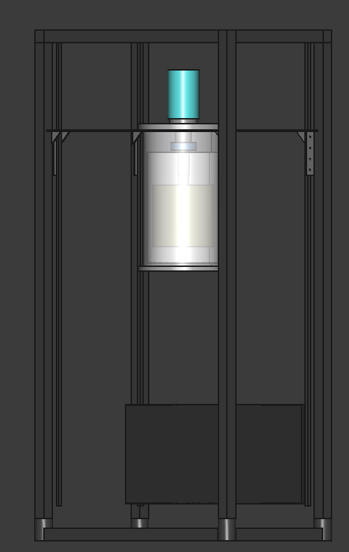

# Cryostat Assembly — Exploded View (Text)

Last updated: 2026-03-11 (BOM rev 0.5)

## Overview

Top-loading design. Cold head hangs from top plate, cold end points down.
All vacuum hardware is standard CF/KF. Custom parts: radiation shield (Al)
and sample stage (Cu).

```
  ┌─────────────────────────────────┐
  │         COMPRESSOR              │  CNA-11RC, 120V, on floor / rack shelf
  │         (300 K)                 │
  └──────────┬──────────────────────┘
             │ flex lines (He supply + return)
             │ cold head cable (motor drive)
             │
  ═══════════╪══════════════════════════  ← TOP PLATE (300K)
  ║    ┌─────┴─────┐   FT  FT  FT  ║     8" CF multiport cluster flange
  ║    │ COLD HEAD │   ○   ○   ○   ║     FT = feedthrough ports (D-sub, SMA)
  ║    │  (motor)  │               ║     Center bore: CF seal to cold head
  ║    │           │               ║     Viton O-ring seal to vessel body
  ║    │           │               ║     (reusable for sample access cycling)
  ║    ├───────────┤ ← 1st stage   ║
  ║    │  (40 K)   │    flange     ║
  ║  ┌─┤           ├─┐             ║
  ║  │ └─────┬─────┘ │             ║
  ║  │  strap│  strap│             ║  ← OFHC Cu thermal straps (×2)
  ║  │       │       │             ║
  ║  │  ┌────┴────┐  │             ║
  ║  ├──┤ RAD     ├──┤  ·····      ║  ← RADIATION SHIELD (40K)
  ║  │  │ SHIELD  │  │  :MLI:      ║     6061 Al cylinder + end caps
  ║  │  │ (Al)    │  │  :   :      ║     FINEMET ribbon wrapped on surface
  ║  │  │         │  │  :   :      ║     MLI blankets on outside of shield
  ║  │  │ FINEMET │  │  :   :      ║     Wires heat-sunk here (GE varnish)
  ║  │  │ wrapped │  │  :   :      ║
  ║  │  │         │  │  :   :      ║
  ║  │  │  ┌───┐  │  │  :   :      ║
  ║  │  │  │2nd│  │  │  :   :      ║  ← 2nd STAGE (4K) cold finger
  ║  │  │  │stg│  │  │  :   :      ║
  ║  │  │  ├───┤  │  │  :   :      ║     Cu strap from 2nd stage ↓
  ║  │  │  │≈≈≈│  │  │  :   :      ║  ← ALUMINA DISK (electrical isolation)
  ║  │  │  │┌─┐│  │  │  :   :      ║  ← SAMPLE STAGE (4K)
  ║  │  │  ││P││  │  │  :   :      ║     OFHC Cu plate, gold-plated
  ║  │  │  ││b││  │  │  :   :      ║     Pb foil wrapped around DUT area
  ║  │  │  │├─┤│  │  │  :   :      ║     Cernox sensor mounted here
  ║  │  │  ││D││  │  │  :   :      ║  ← DUT PCB CARRIER
  ║  │  │  ││U││  │  │  :   :      ║     Wirebonded AQFP die
  ║  │  │  ││T││  │  │  :   :      ║     SMA connectors for RF
  ║  │  │  │└─┘│  │  │  :   :      ║
  ║  │  │  └───┘  │  │  :   :      ║
  ║  │  └─────────┘  │  :···:      ║
  ║  └───────────────┘             ║
  ║                                ║  ← VACUUM VESSEL BODY (300K)
  ║  ○ KF-25 (pump)               ║     SS CF nipple, 6" OD tube
  ║  ○ KF-25 (gauge)              ║     KF stubs welded on sides
  ║  ○ KF-25 (relief valve)       ║
  ║                                ║
  ═════════════════════════════════════  ← BOTTOM PLATE (300K)
                                          Blank 8" CF flange
       │              │
       │              │
  ┌────┴────┐    ┌────┴────┐
  │ HiCube  │    │ Pirani  │
  │ 80 Eco  │    │ gauge   │
  │ (pump)  │    │ CVM211  │
  └─────────┘    └─────────┘
```

## Assembly Layers (outside → inside, top → bottom)

### 300 K — Room Temperature

| # | Part | Material | Interface | BOM item |
|---|---|---|---|---|
| 1 | Equipment rack | Steel | Floor | rack-utilities |
| 2 | Compressor (CNA-11RC) | - | 120V wall outlet | cryocooler-system |
| 3 | Flex lines + cold head cable | SS/Cu | Compressor ↔ cold head | cryocooler-system |
| 4 | Vacuum vessel body | 304L SS | 8" CF top + bottom | cryostat-vessel |
| 5 | Top plate | 304L SS | 8" CF, center bore for cold head | cryostat-vessel |
| 6 | Bottom plate | 304L SS | 8" CF blank (part of nipple) | cryostat-vessel |
| 7 | Viton O-ring (top plate) | Viton | Sample access joint — reusable | rack-utilities |
| 7b | CF copper gaskets | OFHC Cu | Permanent joints (bottom, feedthroughs) | rack-utilities |
| 8 | KF side ports | SS | Welded on vessel body | cryostat-vessel |
| 9 | Pressure relief valve | - | KF-25 port on vessel | rack-utilities |
| 10 | Vacuum gauge (Pirani) | - | KF-25 port | vacuum-plumbing |
| 11 | HiCube turbo pump station | - | KF-25 bellows hose to vessel | vacuum-plumbing |
| 12 | D-sub feedthroughs (×2) | - | CF ports on top plate | vacuum-plumbing |
| 13 | SMA feedthroughs (×4) | - | CF ports on top plate | vacuum-plumbing |

### 300 K → 40 K — Transition

| # | Part | Material | Interface | BOM item |
|---|---|---|---|---|
| 14 | Cold head (RDK-101D) | - | CF seal through top plate | cryocooler-system |
| 15 | PhBr DC wiring loom | Phosphor bronze | Feedthrough → heat sink at 40K → 4K | thermal-wiring |
| 16 | SS coax cables (×4) | Stainless steel | SMA feedthrough → heat sink at 40K → 4K | thermal-wiring |
| 17 | MLI blankets | Al mylar + dacron | Wrapped around rad shield exterior | thermal-wiring |

### 40 K — First Stage

| # | Part | Material | Interface | BOM item |
|---|---|---|---|---|
| 18 | Thermal straps (×2) | OFHC Cu braid | 1st stage flange → rad shield | thermal-wiring |
| 19 | Indium wire | In | Crushed at bolted joints | rack-utilities |
| 20 | Radiation shield | 6061-T6 Al | Cylinder + end caps | cryostat-vessel |
| 21 | FINEMET ribbon | Nanocrystalline | Wrapped on rad shield surface | magnetic-shielding |
| 22 | Si diode sensor | - | Mounted on 1st stage or shield | temperature-monitoring |
| 23 | Wire heat sinking | GE varnish / Cu bobbins | Wires anchored to rad shield | rack-utilities |

### 4 K — Second Stage

| # | Part | Material | Interface | BOM item |
|---|---|---|---|---|
| 24 | Thermal straps (×2) | OFHC Cu braid | 2nd stage → sample stage | thermal-wiring |
| 25 | Indium wire | In | Crushed at bolted joints | (same as #19) |
| 25b | Alumina isolation disk | Al₂O₃ (polycrystalline) | Between cold finger and sample stage | cryostat-vessel |
| 26 | Sample stage | OFHC Cu | Clamped to cold finger through alumina disk | cryostat-vessel |
| 27 | Lead foil shield | Pb, 0.1 mm | Wrapped around DUT area | magnetic-shielding |
| 28 | Cernox sensors (×2) | - | 1 on 2nd stage, 1 on DUT mount | temperature-monitoring |
| 29 | DUT PCB carrier | FR4/Rogers + Cu | Bolted to sample stage | thermal-wiring |

## Signal Path

```
External instruments (GS200, 2182A)
       │ DC: BNC/banana cables
       │ RF: SMA cables
       ▼
  ┌─────────────┐
  │ Feedthroughs │  D-sub (DC), SMA (RF) — hermetic, on top plate
  └──────┬──────┘
         │ PhBr wire (DC), SS coax (RF) — inside vacuum
         │
    ┌────┴────┐
    │ 40K     │  Wires thermally anchored (GE varnish / Cu bobbins)
    │ shield  │  Intercepted heat goes to 1st stage
    └────┬────┘
         │
    ┌────┴────┐
    │ 4K DUT  │  DC bias pads + SMA edge-launch on PCB
    │ carrier │  Wirebonded to AQFP die
    └─────────┘
```

## Temperature Readout Path

```
  Cryocon 22C controller (rack-mounted, 300K)
       │ 4-wire sensor cables through D-sub feedthrough
       │
       ├── Cernox #1: on 2nd stage cold finger (4K reference)
       ├── Cernox #2: on DUT mount / sample stage (4K at DUT)
       └── Si diode: on 1st stage or rad shield (40K)
```

## Vacuum Path

```
  Atmosphere
       │
  ┌────┴────┐
  │ HiCube  │  Turbo + diaphragm backing pump
  │ 80 Eco  │  KF-25 bellows hose to vessel
  └────┬────┘
       │
  ┌────┴────┐
  │ Vessel  │  SS CF nipple body
  │ interior│  Pirani gauge on KF-25 side port
  │         │  Relief valve on KF-25 side port
  └─────────┘
       ↓ at 4K, cryopumping maintains <1e-6 Torr
```

## MLI (Multi-Layer Insulation) — Sourcing & Installation

**Required for shields larger than Ø150mm.** See thermal budget appendix.
For Ø200–300mm shields, MLI reduces 1st stage radiation load by >10×.

### Material needed

10 layers on a Ø200mm × 300mm shield: ~2 m² each of reflector + spacer.

### Sourcing options

| Option | Reflector | Spacer | Cost | Lead |
|---|---|---|---|---|
| **DIY (recommended)** | Aluminized mylar photo-film (Amazon) | 100% polyester mosquito netting ([Joann Fabric](https://www.joann.com)) | ~$50-75 | Days |
| **Professional** | Double-aluminized PET ([Dunmore](https://www.dunmore.com), Bristol PA) | Dacron netting (cryo supplier) | ~$300-500 | 1-2 wk |
| **Pre-made blankets** | Custom MLI blankets ([FrakoTerm](https://frakoterm.com), Poland) | Integrated | ~$500+ | 2-4 wk |

WSU HYPER lab [tested DIY vs professional MLI](https://hydrogen.wsu.edu/2020/06/16/how-to-make-cryogenic-multi-layer-insulation-mli-shields/)
and found comparable thermal performance after a few layers.
With our >90% thermal margin, DIY is more than adequate.

### Installation notes

- Wear gloves (fingerprint oils reduce reflectivity)
- Stagger seams between layers (avoid thermal short circuits)
- Leave small gaps in seams for pump-out (don't fully tape-seal)
- Use mylar tape on seams, not metal fasteners
- Anchor with pipe cleaners or wire ties (minimal thermal conduction)
- FINEMET goes on the radiation shield surface; MLI wraps over FINEMET
- Adds ~15-30 min to pumpdown time (outgassing from extra surface area)

## 3D Printed Parts (PLA at 4K)

PLA has been validated at 4K for non-thermally-conductive structural parts.
Low thermal conductivity is a feature for isolation. Fast iteration, cheap.

### Print candidates

| Part | Benefit | Notes |
|---|---|---|
| Wire routing bobbins (40K) | Custom geometry for PhBr + coax routing | Replaces machined Cu bobbins |
| DUT mount adapter | Iterate with DUT pinout changes | Sits on Cu sample stage |
| Magnetic shield brackets | Hold FINEMET + Pb foil in position | Inside radiation shield |
| Thermal isolation standoffs | Low-k spacers between stages | Replaces G10 tubes |
| Feedthrough strain reliefs | Cable management from top plate to shield | Replaces zip ties / Kapton |
| Assembly alignment jigs | Temporary fixtures during integration | Don't need to survive cryo |

### Must remain metal

| Part | Reason |
|---|---|
| Radiation shield | Must conduct heat to 1st stage (Al) |
| Sample stage | Must conduct heat to 2nd stage (Cu) |
| Vacuum vessel + top plate | Must hold vacuum (SS) |
| Thermal straps | Must conduct heat (OFHC Cu) |

### Outgassing

PLA outgasses water + volatiles at room temp in vacuum. Manageable:
turbo pump handles it during pumpdown (adds a few minutes). Once cold,
outgassing drops to near zero. Optional: light bake at 50–60°C under
vacuum before cooldown drives off most volatiles. Do not exceed 60°C
(PLA glass transition).

## Ground Isolation

See [ADR-004](../decisions/004-ground-isolation.md) and `docs/ground_isolation_memo.docx`.

The cold head body is galvanically continuous with the compressor chassis
(through stainless flex lines) and therefore to AC mains earth. The GM
valve motor injects periodic current transients into this ground structure.

**Two isolation points** keep motor noise out of the measurement path:

1. **Alumina disk at 4 K** — polycrystalline Al₂O₃, 25–30 mm diameter,
   1–2 mm thick, indium foil both faces. Inserted between the 2nd-stage
   cold finger and the copper backplane. Breaks the galvanic path between
   the cryocooler structure and the circuit ground.

2. **Isolation transformer at 300 K** — Tripp Lite IS500HG (500 W,
   Faraday-shielded, medical-grade). Powers only the readout electronics.
   Compressor stays on building mains, earth-grounded.

This creates two ground domains:

- **Domain 1 (earth):** mains → compressor → flex lines → cold head →
  vacuum jacket → rack chassis. No measurement signals.
- **Domain 2 (isolated):** isolation transformer → readout electronics →
  feedthrough pins → copper backplane at 4 K. Signal and bias only.

**Assembly discipline:** no readout cable shield, coax braid, or probe
ground may touch the cryostat body or rack chassis. All electrical
connections between readout and cryostat pass through feedthrough pins
only. Ceramic-to-metal hermetic feedthroughs maintain isolation by design.

## Open Design Questions

1. **Vessel length**: depends on RDK-101D dimensions from outline drawing.
   Need: 1st stage to 2nd stage distance + sample space below 2nd stage
   + clearance above 1st stage for MLI/wiring routing.
2. **Top plate port layout**: number and placement of CF sub-ports depends
   on total wire count and whether pumping goes on side or through top.
3. **Radiation shield height**: must clear 2nd stage + sample stage + DUT
   + Pb foil + wiring strain relief. Target ≥120 mm internal height.
4. **FINEMET inside or outside MLI?**: FINEMET on the radiation shield
   surface (at 40K), MLI on outside of FINEMET. FINEMET must be at
   cryogenic temp for best permeability.
5. **Vessel bore size**: current design uses DN160CF (6" OD tube, 8" CF
   flanges, ~140 mm ID). Ground isolation memo describes DN200CF (8" OD
   tube, 10" CF flanges, ~200 mm ID) with a Lesker zero-length reducer
   (RF1000X450 or RF1000X600) for cold head mounting. Larger bore gives
   more space for wiring and radiation shield but increases radiative
   load (MLI mandatory). Resolve before ordering vessel.
6. **RDK-101D CF flange size**: believed CF4.50 / DN63CF based on
   130 mm body envelope. Confirm with SHI before ordering zero-length
   reducer.

---

## Working Render

FreeCAD model of the complete rack-mounted system:



*42U rack with cryostat mounted at U35 (top) and CNA-11R compressor at U1 (bottom).
Aluminum mounting frame supports cryostat flange on 19" rails.*
