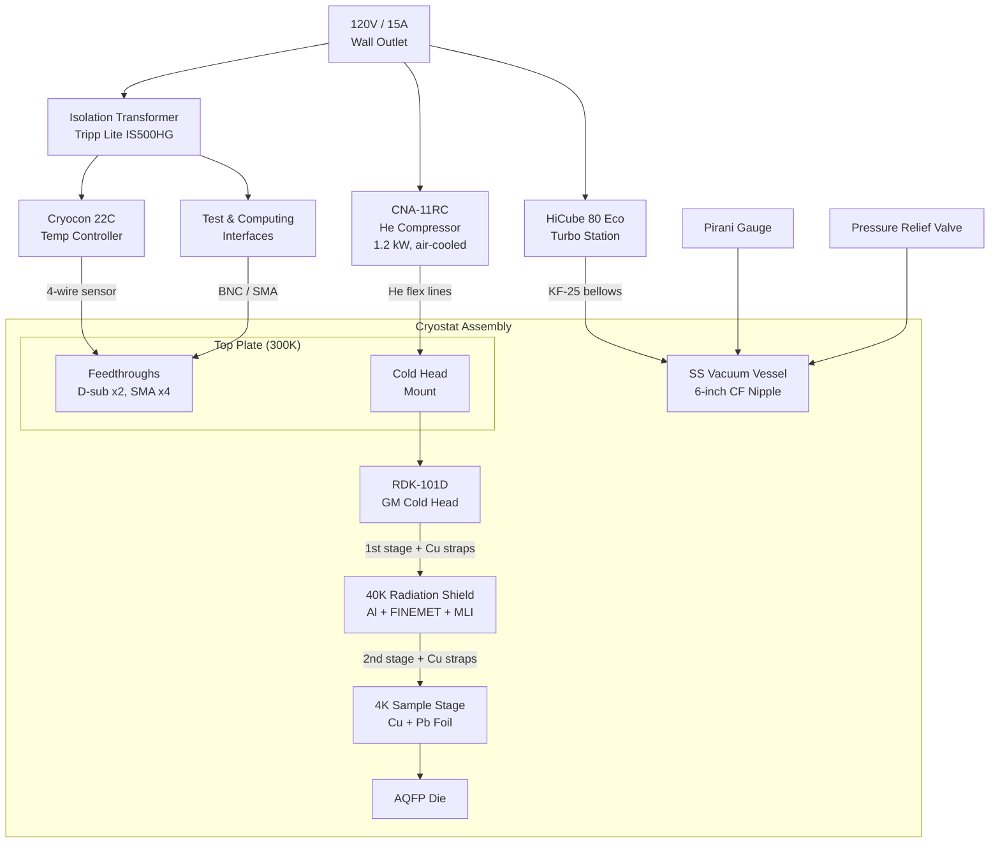

# AQFP Cryogenic Rack — Design Package

**Revision 0.6 — March 2026**

---

## Executive Summary

This document describes the design of a self-contained cryogenic rack
for deploying AQFP (Adiabatic Quantum Flux Parametron) superconducting
processors at 4.2 K. The system is built entirely from off-the-shelf and
standard vacuum components, housed in a 19-inch equipment rack, and designed
for portability between sites.

**Key specifications:**

| Parameter | Value |
|---|---|
| Operating temperature | 4.2 K (second stage), ~40 K (first stage) |
| Cryocooler | SHI RDK-101D + CNA-11RC (GM, air-cooled) |
| Cooling capacity | 100 mW @ 4.2 K, ~6 W @ 45 K |
| Thermal margin | >90% on both stages (with MLI) |
| Power | 120V / 15A standard wall outlet (~2 kW total) |
| Cooling water | Not required |
| Form factor | 19-inch rack (compressor rack-mounted) |
| Vacuum | HiCube 80 Eco turbo station, <10⁻⁸ Torr ultimate |
| Magnetic shielding | FINEMET (40 K) + superconducting Pb foil (4 K) |
| Cooldown time | ~60–90 minutes to 4 K |

**Estimated cost:** ~$52k for the rack build.

**Timeline:** 4 weeks from procurement start to operational, gated by the
12-week cryocooler lead time.

**Deployment plan:** Vertiv (first), then CBA and AM. The system is designed
to be relocated with minimal effort — standard power, air-cooled, modular
construction.

---

## 1. System Architecture

The cryo rack is a self-contained cryogenic deployment platform. A GM cryocooler,
vacuum system, magnetic shielding, and instrumentation are housed in a
standard 19-inch rack, with all signal and power connections accessible from
the front or rear panel.



### Thermal stages

The system has three thermal stages:

- **300 K (room temperature):** Vacuum vessel walls, feedthroughs, pump,
  compressor, and all room-temperature electronics.
- **~40 K (first stage):** Aluminum radiation shield with FINEMET
  nanocrystalline magnetic shielding and MLI blankets. Wiring is thermally
  intercepted here.
- **4.2 K (second stage):** OFHC copper sample stage where the AQFP die is
  mounted, surrounded by superconducting lead foil for residual magnetic
  field attenuation.

### Signal path

DC bias currents are delivered via phosphor bronze twisted pairs, heat-sunk
at 40 K and 4 K. AC clock signals travel on semi-rigid stainless steel
coaxial cables, also thermally intercepted at both stages. All connections
terminate at room-temperature feedthroughs on the cryostat top plate.

### Ground isolation

The cold head body is galvanically continuous with the compressor chassis
through the stainless steel flex lines. The compressor is earth-grounded
through its AC power cord. The GM cycle valve motor produces periodic
current transients (~1 Hz) that propagate through this ground structure.

The system uses two isolated ground domains (see ADR-004):

- **Domain 1 (earth ground):** Building mains → compressor chassis →
  flex lines → cold head → vacuum jacket → rack chassis. Carries
  compressor motor currents. No measurement signals.
- **Domain 2 (isolated measurement ground):** Isolation transformer
  secondary → readout electronics → feedthrough pins → copper backplane
  at 4 K → AQFP circuit ground. Signal and bias currents only.

Isolation is maintained by:

| Location | Component | Function |
|---|---|---|
| 4 K (cold finger) | Polycrystalline alumina disk, 25–30 mm, indium foil both faces | Breaks galvanic path between cryocooler and circuit ground |
| 300 K (feedthroughs) | Ceramic-to-metal hermetic seals | Pins isolated from flange body by design |
| 300 K (power entry) | Tripp Lite IS500HG isolation transformer (500 W, Faraday-shielded) | Isolates readout ground from building mains |

**Critical assembly discipline:** No readout cable shield, coax braid,
ground lug, or debug probe ground may touch the cryostat body, vacuum
jacket, or rack chassis during measurement.

---

## 2. Cryostat Assembly

### Design philosophy

All vacuum hardware is standard CF/KF catalog items sourced from multiple
vendors (Kurt Lesker, MDC, Nor-Cal, Ideal Vacuum). Only the radiation shield
and sample stage are custom machined — simple aluminum and copper parts any
machine shop can make. No single-vendor lock-in.

The cryostat is top-loading: the cold head hangs from the top plate with the
cold end pointing down. Feedthroughs are on the top plate or welded side
ports. Pumping connects via KF-25 ports on the vessel body.

### Cross-section

```
  ┌─────────────────────────────────┐
  │         COMPRESSOR              │  CNA-11RC, 120V, rack-mounted
  │         (300 K)                 │
  └──────────┬──────────────────────┘
             │ flex lines (He supply + return)
             │ cold head cable (motor drive)
             │
  ═══════════╪══════════════════════════  ← TOP PLATE (300K)
  ║    ┌─────┴─────┐   FT  FT  FT  ║     8" CF multiport cluster flange
  ║    │ COLD HEAD │   ○   ○   ○   ║     FT = feedthrough ports (D-sub, SMA)
  ║    │  (motor)  │               ║     Center bore: CF seal to cold head
  ║    │           │               ║     Viton O-ring seal to vessel body
  ║    │           │               ║     (reusable for sample access cycling)
  ║    ├───────────┤ ← 1st stage   ║
  ║    │  (40 K)   │    flange     ║
  ║  ┌─┤           ├─┐             ║
  ║  │ └─────┬─────┘ │             ║
  ║  │  strap│  strap│             ║  ← OFHC Cu thermal straps (x2)
  ║  │       │       │             ║
  ║  │  ┌────┴────┐  │             ║
  ║  ├──┤ RAD     ├──┤  ·····      ║  ← RADIATION SHIELD (40K)
  ║  │  │ SHIELD  │  │  :MLI:      ║     6061 Al cylinder + end caps
  ║  │  │ (Al)    │  │  :   :      ║     FINEMET ribbon wrapped on surface
  ║  │  │         │  │  :   :      ║     MLI blankets on outside of shield
  ║  │  │ FINEMET │  │  :   :      ║     Wires heat-sunk here (GE varnish)
  ║  │  │ wrapped │  │  :   :      ║
  ║  │  │         │  │  :   :      ║
  ║  │  │  ┌───┐  │  │  :   :      ║
  ║  │  │  │2nd│  │  │  :   :      ║  ← 2nd STAGE (4K) cold finger
  ║  │  │  │stg│  │  │  :   :      ║
  ║  │  │  ├───┤  │  │  :   :      ║     Cu strap from 2nd stage
  ║  │  │  │   │  │  │  :   :      ║
  ║  │  │  │┌─┐│  │  │  :   :      ║  ← SAMPLE STAGE (4K)
  ║  │  │  ││P││  │  │  :   :      ║     OFHC Cu plate, gold-plated
  ║  │  │  ││b││  │  │  :   :      ║     Pb foil wrapped around DUT area
  ║  │  │  │├─┤│  │  │  :   :      ║     Cernox sensor mounted here
  ║  │  │  ││D││  │  │  :   :      ║  ← DUT PCB CARRIER
  ║  │  │  ││U││  │  │  :   :      ║     Wirebonded AQFP die
  ║  │  │  ││T││  │  │  :   :      ║     SMA connectors for RF
  ║  │  │  │└─┘│  │  │  :   :      ║
  ║  │  │  └───┘  │  │  :   :      ║
  ║  │  └─────────┘  │  :···:      ║
  ║  └───────────────┘             ║
  ║                                ║  ← VACUUM VESSEL BODY (300K)
  ║  ○ KF-25 (pump)               ║     SS CF nipple, 6" OD tube
  ║  ○ KF-25 (gauge)              ║     KF stubs welded on sides
  ║  ○ KF-25 (relief valve)       ║
  ║                                ║
  ═════════════════════════════════════  ← BOTTOM PLATE (300K)
                                         Blank 8" CF flange
       │              │
       │              │
  ┌────┴────┐    ┌────┴────┐
  │ HiCube  │    │ Pirani  │
  │ 80 Eco  │    │ gauge   │
  │ (pump)  │    │ CVM211  │
  └─────────┘    └─────────┘
```

### Assembly layers

#### 300 K — Room temperature

| # | Part | Material | Interface |
|---|---|---|---|
| 1 | Equipment rack | Steel | Floor |
| 2 | Compressor (CNA-11RC) | — | 120V wall outlet |
| 3 | Flex lines + cold head cable | SS/Cu | Compressor to cold head |
| 4 | Vacuum vessel body | 304L SS | 8" CF top + bottom |
| 5 | Top plate | 304L SS | 8" CF, center bore for cold head |
| 6 | Bottom plate | 304L SS | 8" CF blank |
| 7 | Viton O-ring (top plate seal) | Viton | Reusable sample access joint |
| 8 | CF copper gaskets | OFHC Cu | Permanent joints |
| 9 | KF side ports | SS | Welded on vessel body |
| 10 | Pressure relief valve | — | KF-25 port on vessel |
| 11 | Vacuum gauge (Pirani) | — | KF-25 port |
| 12 | HiCube turbo pump station | — | KF-25 bellows hose to vessel |
| 13 | D-sub feedthroughs (x2) | — | CF ports on top plate |
| 14 | SMA feedthroughs (x4) | — | CF ports on top plate |

#### 40 K — First stage

| # | Part | Material | Interface |
|---|---|---|---|
| 15 | Cold head (RDK-101D) | — | CF seal through top plate |
| 16 | Thermal straps (x2) | OFHC Cu braid | 1st stage flange to rad shield |
| 17 | Indium wire | In | Crushed at bolted joints |
| 18 | Radiation shield | 6061-T6 Al | Cylinder + end caps |
| 19 | FINEMET ribbon | Nanocrystalline | Wrapped on rad shield surface |
| 20 | MLI blankets | Al mylar + dacron | Wrapped around shield exterior |
| 21 | Si diode sensor | — | Mounted on shield |
| 22 | Wire heat sinking | GE varnish | Wires anchored to rad shield |

#### 4 K — Second stage

| # | Part | Material | Interface |
|---|---|---|---|
| 23 | Thermal straps (x2) | OFHC Cu braid | 2nd stage to sample stage |
| 23b | Alumina isolation disk | Al₂O₃ (polycrystalline) | Between cold finger and sample stage (see §1, ground isolation) |
| 24 | Sample stage | OFHC Cu | Clamped to cold finger through alumina disk |
| 25 | Lead foil shield | Pb, 0.1 mm | Wrapped around DUT area |
| 26 | Cernox sensors (x2) | — | 2nd stage + DUT mount |
| 27 | DUT PCB carrier | FR4/Cu | Bolted to sample stage |

### Wiring path

```
External instruments (GS200, 2182A)
       │ DC: BNC/banana cables
       │ RF: SMA cables
       ▼
  ┌─────────────┐
  │ Feedthroughs │  D-sub (DC), SMA (RF) — hermetic, on top plate
  └──────┬──────┘
         │ PhBr wire (DC), SS coax (RF) — inside vacuum
         │
    ┌────┴────┐
    │ 40K     │  Wires thermally anchored (GE varnish on bobbins)
    │ shield  │  Intercepted heat goes to 1st stage
    └────┬────┘
         │
    ┌────┴────┐
    │ 4K DUT  │  DC bias pads + SMA edge-launch on PCB
    │ carrier │  Wirebonded to AQFP die
    └─────────┘
```

### Vacuum path

```
  Atmosphere
       │
  ┌────┴────┐
  │ HiCube  │  Turbo + diaphragm backing pump
  │ 80 Eco  │  KF-25 bellows hose to vessel
  └────┬────┘
       │
  ┌────┴────┐
  │ Vessel  │  SS CF nipple body
  │ interior│  Pirani gauge on KF-25 side port
  │         │  Relief valve on KF-25 side port
  └─────────┘
       ↓ at 4K, cryopumping maintains <1e-6 Torr
```

### Modularity and cryocooler swapping

The top plate is the only cryocooler-specific part. If the cold head
changes (e.g., from RDK-101D to BMC401 or a pulse tube), only the top
plate needs replacement or re-machining (~$400 cost). All other cryostat
components are cold-head agnostic.

---

## 3. Thermal Budget

### Cryocooler capacity

RDK-101D with CNA-11RC compressor at 60 Hz (US power):

| Stage | Temperature | Capacity |
|---|---|---|
| 1st stage | 45–60 K | 3–5 W |
| 2nd stage | 4.2 K | **100 mW** |

### 4 K (second stage) heat budget

| Source | Load (mW) |
|---|---|
| Radiation (40 K to 4 K) | 0.3 |
| DC wire conduction (16x PhBr 36AWG) | 0.1 |
| RF coax conduction (4x SS 0.086") | 2.0 |
| DUT dissipation (AQFP: nW–uW) | ~0 |
| **Total** | **~2.4** |
| **Available** | **100** |
| **Utilization** | **2.4%** |

### 40 K (first stage) heat budget

| Source | With MLI | Without MLI |
|---|---|---|
| Radiation (300 K to 40 K) | 120 mW | 1,800 mW |
| DC wire conduction | 3 mW | 3 mW |
| RF coax conduction | 35 mW | 35 mW |
| **Total** | **~160 mW** | **~1,840 mW** |
| **Available** | **~3,000 mW** | **~3,000 mW** |
| **Utilization** | **5%** | **61%** |

Both stages have large thermal margin. MLI is recommended but not
strictly required at the baseline shield size (100 mm diameter). For
larger shields (200–300 mm), MLI is mandatory — see appendix.

### Shield sizing (how big can we go?)

With MLI, shield size is thermally unconstrained for any rack-mount design:

| Shield (dia x H) | Area | With MLI | Without MLI |
|---|---|---|---|
| 100 x 150 mm | 0.063 m² | 95 mW **(3%)** | 1.4 W (48%) |
| 200 x 300 mm | 0.251 m² | 376 mW **(13%)** | 5.8 W (OVER) |
| 300 x 400 mm | 0.518 m² | 777 mW **(26%)** | 12 W (OVER) |

A 200–300 mm diameter shield provides generous working space for
multiple DUTs and complex wiring, uses only 13–26% of the first-stage
budget with MLI, and fits comfortably in a 19-inch rack (450 mm between
rails).

---

## 4. Cryocooler Selection

### Comparison of quoted options

| Parameter | SHI RDK-101D | SHI RDC-02K | Bama BMC401 | Cryomech PT205 |
|---|---|---|---|---|
| **Type** | GM | GM | GM | Pulse tube |
| **Quoted price** | $27,230 | $37,155 | $13,000 | $42,325 |
| **Lead time** | 12 weeks | 12 weeks | 4 weeks | 36–40 weeks |
| **4 K capacity** | 0.1 W | 0.2 W | 0.16 W | 0.1–0.3 W |
| **40 K capacity** | ~6 W @ 45 K | ~6 W @ 45 K | 3 W @ 45 K | TBD |
| **Min temp** | ~3.5 K | < 2 K | < 2.3 K | 5–6 K |
| **120V / 15A** | **Yes** | **Yes** | **No** (220V) | **Likely yes** |
| **Cooling** | Air | Air | Unconfirmed | Air |
| **Compressor power** | ~1.2 kW | ~1.2 kW | ~1.5 kW | ~1.5 kW |
| **Maintenance** | 10,000 hr | 10,000 hr | 10,000 hr | ~20,000 hr |
| **Vibration** | Moderate (GM) | Moderate (GM) | Moderate (GM) | Low (PT) |

### Selection rationale

**Primary: SHI RDK-101D + CNA-11RC** — 120V plug-and-play, air-cooled,
well-established platform with extensive support. 12-week lead time.

**Upgrade option: SHI RDC-02K + CNA-11RC** — same compressor and rack
integration as the RDK-101D, but 2x the 4 K capacity (0.2 W) and
guaranteed < 2 K base temperature. $10k premium over the RDK-101D.
Relevant if Phase 2 wiring loads grow or sub-4 K operation is needed.

**Backup: Bama BMC401** — half the cost, 4-week delivery, but 220V/50Hz
compressor is not compatible with standard 120V/15A outlets. Under
evaluation for 60 Hz compatibility and potential pairing with SHI CNA-11RC
compressor.

**Not selected: Cryomech PT205** — 36–40 week prototype lead time and
highest cost eliminate it for near-term build. Low vibration and longer
maintenance interval do not materially benefit AQFP electrical testing.
Reconsidering for future permanent installations.

---

## 5. Bill of Materials

<!-- BOM_TABLES -->

*Full BOM is auto-generated from `bom/bom.yaml` (rev 0.6) by the build
script. The tables below show active items only (qty > 0). Reference-only
options (alternative cryocoolers, scroll pump) are excluded from cost
totals.*

---

## 6. Site Requirements — Vertiv

### Power

| Requirement | Specification |
|---|---|
| Outlet type | NEMA 5-15 (standard US 120V / 15A) |
| Circuits needed | 2 recommended (compressor on one, instruments on another) |
| Total power draw | ~2–3 kW |
| Compressor | ~1.2 kW (CNA-11RC), direct to building mains (earth-grounded) |
| Turbo pump | ~150 W (HiCube 80 Eco) |
| Instruments | ~200 W behind isolation transformer (Tripp Lite IS500HG, 500 W) |

No special electrical work required. Standard office/lab outlets are
sufficient. The readout electronics are powered through a rack-mounted
isolation transformer to maintain a clean, isolated measurement ground
(see §1, ground isolation).

### Space

| Requirement | Specification |
|---|---|
| Rack | 19-inch standard, ~20U minimum |
| Rack footprint | ~0.6 x 0.8 m |
| Compressor | Rack-mounted (CNA-11RC fits 19-inch rack) |
| Clearance | Allow ~0.5 m behind rack for cable routing and airflow |
| Cryostat position | Top of rack or adjacent bench |

### Environment

| Requirement | Specification |
|---|---|
| Ambient temperature | 15–30 C (standard lab/office) |
| Cooling water | **Not required** (air-cooled compressor) |
| Ventilation | Standard room HVAC sufficient; compressor rejects ~1–2 kW as heat |
| Floor loading | ~150–200 kg total (rack with compressor + cryostat) |
| Vibration isolation | Not required for AQFP testing |

### Network (optional)

- Ethernet for Cryocon 22C remote temperature monitoring
- USB for instrument control (GS200, 2182A)

### Facility preparation checklist

- [ ] Confirm availability of 2x 120V / 15A outlets near rack location
- [ ] Confirm 19-inch rack (Vertiv may supply) or designate rack location
- [ ] Confirm rack has sufficient depth for compressor (~600 mm)
- [ ] Confirm adequate room ventilation for ~2 kW heat rejection
- [ ] Assign Ethernet drop if remote monitoring desired

---

## 7. Timeline

**Target:** Operational cryo rack within 4 weeks of procurement start.

| Week | Activities |
|---|---|
| **1** | Finalize cryocooler selection. Send RFQs. Order long-lead items. Complete cryostat detailed design. |
| **2** | Place all orders. Commission custom machining (radiation shield, sample stage). Begin rack layout. |
| **3** | Receive and inspect components. Assemble cryostat. Install magnetic shielding. Wire feedthroughs. Room-temperature functional tests. |
| **4** | Leak check vacuum system. Pump down and cooldown. Verify base temperature. Measure residual magnetic field. Functional test with AQFP die (if available). |

### Critical path

The 12-week cryocooler lead time (SHI RDK-101D) gates the overall
schedule. All other components have 1–2 week lead times. During the
cryocooler wait:

- Complete cryostat detailed design using outline drawing dimensions
- Procure and assemble all non-cryocooler components
- Perform room-temperature vacuum and wiring tests
- Prepare DUT carriers and test fixtures

If BMC401 (4-week lead) is selected as backup, the full build can be
completed in approximately 5–6 weeks end-to-end.

---

## 8. Open Items and Risks

### Open actions

| # | Action | Owner | Status |
|---|---|---|---|
| 1 | Re-quote SHI RDK-101D (Quote 5618 expired). Specify CF flange option. | Procurement | Pending |
| 2 | Confirm Cryomech PT205 120V availability when re-quoting | Procurement | Pending |
| 3 | Clarify Bama BMC401 mounting pattern, 60 Hz compatibility, SHI compressor compatibility | Engineering | Pending |
| 4 | Finalize cryostat vessel length from RDK-101D outline drawing dimensions | Engineering | Pending |
| 5 | Detailed top plate port layout (feedthrough count and placement) | Engineering | Pending |
| 6 | DUT PCB carrier design (depends on AQFP die pinout) | Engineering | Pending |

### Risk register

| Risk | Impact | Mitigation |
|---|---|---|
| Cryocooler lead time (12 wk) | Schedule slip | BMC401 backup (4 wk). Pre-assemble all other components. |
| RDK-101D quote expired | Price/availability change | Re-quote immediately. Budget has margin. |
| BMC401 not 120V compatible | Limits portability | Investigate SHI CNA-11RC + BMC401 cold head hybrid. |
| Custom machining delays | 1–2 week slip | Use Protolabs/Xometry for fast-turn; simple parts. |
| MLI installation quality | Higher thermal load | >90% margin on both stages absorbs poor MLI. |
| Vacuum leak at O-ring seal | Pumpdown failure | Turbo pump can maintain vacuum continuously. Viton adequate to 10⁻⁷ Torr. |

---

## Appendix A: MLI Sourcing

10-layer MLI blankets are recommended for radiation shields larger than
150 mm diameter. Material needed for a 200 mm x 300 mm shield:
~2 m² each of reflector and spacer.

| Option | Material | Cost | Lead Time |
|---|---|---|---|
| **DIY (recommended)** | Aluminized mylar (Amazon) + polyester netting (Joann Fabric) | $50–75 | Days |
| **Professional** | Double-aluminized PET (Dunmore) + Dacron netting | $300–500 | 1–2 weeks |
| **Pre-made blankets** | Custom blankets (FrakoTerm, Poland) | $500+ | 2–4 weeks |

DIY MLI has been validated by WSU HYPER lab as comparable in thermal
performance to professional MLI. With >90% thermal margin, DIY is more
than adequate.

MLI adds ~15–30 minutes to pumpdown time due to additional outgassing
surface area. This is a manageable trade-off.

## Appendix B: 3D Printed Parts (PLA at 4 K)

PLA has been validated at 4 K for non-thermally-conductive structural
parts. Low thermal conductivity is a feature for thermal isolation.

**Suitable for 3D printing:**

| Part | Benefit |
|---|---|
| Wire routing bobbins (40 K) | Custom geometry for wire routing |
| DUT mount adapter | Fast iteration as DUT pinout changes |
| Magnetic shield brackets | Hold FINEMET + Pb foil in position |
| Thermal isolation standoffs | Low-conductivity spacers between stages |
| Feedthrough strain reliefs | Cable management |

**Must remain metal:** Radiation shield (Al), sample stage (Cu),
vacuum vessel (SS), thermal straps (OFHC Cu).

PLA outgasses at room temperature in vacuum but this is handled by
the turbo pump during pumpdown (adds a few minutes). Once cold,
outgassing drops to near zero.
